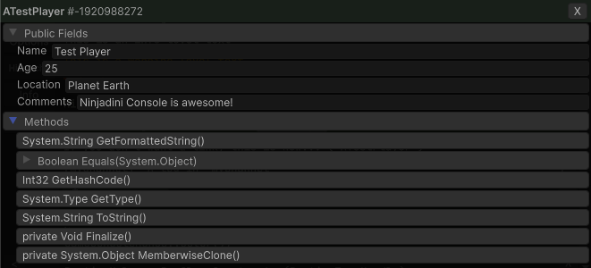
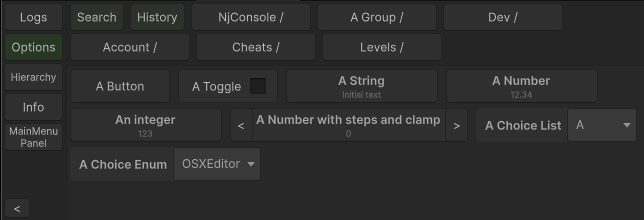

# Ninjadini Debug Console for Unity

Your ultimate debug console for Unity.

- 📜 Runtime log viewer with filtering, search, and clickable stack traces
- ⌨️ Near zero allocation logs
- 🧩 Object inspector for exploring objects directly from log entries
- 🧭 Hierarchy viewer — see live GameObjects and components
- 🎮 Add custom menu items and keybindings for cheats or tools
- 🖥️ Works in Unity Editor (seperate editor windows or in game view), standalone builds, mobile, and WebGL
- 🧱 Modular: write your own modules and plug them into the console

---

# Getting started

### Open console window in editor
- `Windows > Window/⌨ Ninjadini Console`
- You can open multiple windows by choosing (new window) option.


### Open console in game view
- With keyboard: default trigger is `` ` `` key (Top left button on US keyboard).
- With mouse: Hold for 3 seconds at top left part of game screen.
- With mouse: Tap 3 times at the top left corner of game screen.

All of the above can be customized in project settings > Ninjadini ⌨ Console


## NjLogger

Unlike Debug.Log, which allocates memory and produce expensive stack trace strings, NjLogger:
- Avoids GC pressure with zero-allocation argument formatting
- Integrates seamlessly with NjConsole (filtering, channels, and object inspection)
```     
NjLogger.Debug("This is an debug level text");
NjLogger.Info("This is an info level text");
NjLogger.Warn("This is a warning level text");
NjLogger.Error("This is an error level text");
        
NjLogger.Info("Mix multiple argument types without allocation... integer:", 123, "float:", 123.45f, "bool:", true);

var aTestObj = GetTestPlayerObj();
NjLogger.Info("Here is a log with a link to ", aTestObj.AsLogRef());
NjLogger.Info("If you don't want a link, this is how... (", aTestObj?.ToString(), ")");


static readonly LogChannel channel = new LogChannel("myChannel"); // this should be at class level

channel.Info("A log in `myChannel`");
channel.Warn("A warning in `myChannel`");

```

Logs from Debug.Log() will still come through to console (default setting).


## Log filtering


- Filter by Text Search  
  You can add multiple conditions...
  - `And` operator: Must match to pass filter
  - `Or` operator: Must match at least one of the conditions that also have `Or` operator.
  - `Not` operator: Must not match to pass filter
- Filter by Channels
  - [ * ] See all logs - no filtering
  - [ - ] See logs with no channel
- Filter by Levels (Info, Warn, Error)


# Logs object linking
You can link and print an object to console. 
```
var aTestObj = GetTestPlayerObj();
NjLogger.Info("A simple object link:", aTestObj);
NjLogger.Info("Here is a link to", aTestObj.AsLogRef(), "mixed in multiple arguments");
```
It will keep a weak reference to the object unless you specifically ask for strong reference.
`NjLogger.Info("A strong object link:", aTestObj.AsStrongLogRef());`

A button will show up when you click on the log in console

You can then inspect the object and modfiy the values via that link.


> [!WARNING]
> Object inspector's primary purpose is to allow you to debug things easily but it does not fully support modifying the data.

# Options menu / cheats



Note: The side-bar of console only shows up if there are other panels to show, otherwise it'll only show the logs panel.  

First create a catalog.  
`ConsoleOptions.Catalog catalog = NjConsole.Options.CreateCatalog();`  
Catalogs are useful because when you no longer need a set of option menus, you can just call `catalog.RemoveAll()`.  

## Add a button
```
catalog.AddButton("My First Button", () => Debug.Log("Clicked my first button"));

catalog.AddButton("A Directory / Child Directory / Child Button", () => Debug.Log("Child button was clicked"));

catalog.AddButton("My Space Key Bound Button", () => Debug.Log("Clicked my Space key bound button"))
        .BindToKeyboard(KeyCode.Space);

catalog.AddButton("My auto close button", () => Debug.Log("Auto close button clicked"))
        .AutoCloseOverlay();
```


## Add a toggle
```
var toggle1 = false;
var toggle2 = false;

catalog.AddToggle("My First Toggle", () => toggle1, (v) => toggle1 = v);

catalog.AddToggle("My T key Bound Toggle", () => toggle2, (v) => toggle2 = v);
        .BindToKeyboard(KeyCode.T)
        .AutoCloseOverlay();
```


> [!TIP]
> Both buttons and toggles can be bound to a keyboard key via `...BindToKeyboard(KeyCode.Space)`.  
> Shift + Ctrl + E style combo can be done via `...BindToKeyboard(KeyCode.E, ConsoleKeyBindings.Modifier.Shift | ConsoleKeyBindings.Modifier.Ctrl)`.  
>    
> Set console overlay to auto close after you press the button via `...AutoCloseOverlay()`.  
> Warning, only a 1 keybinding per item.


## Add number prompt
```
var aFloat = 12.34f;
catalog.AddNumberPrompt("A Number", () => aFloat, (v) => aFloat= v);

var int0To100 = 50;
catalog.AddNumberPrompt("0 to 100", () => int0To100, (v) => int0To100 = Mathf.Clamp(v, 0, 100));

var steppedNumber = 10;
catalog.AddNumberPrompt("Stepped number", () => steppedNumber, (v) => steppedNumber = v, 5);
```


## Add text prompt
```
var text = "Initial text";
catalog.AddTextPrompt("My Text Prompt", () => text, (v) => text = v);

var text = "Initial text";
catalog.AddTextPromptWithValidation("My validated text", 
  getter: () => text, 
  setter: v => {
        if (v.Length <= 5)
        {
                text = v;
                return true;
        }
        return false; // Return false to block user from closing the dialog with an invalid value.
  },
  validator: (v) => {
        if (v.Length > 5) v = v.Substring(0, 5); // Trim out invalid characters and return the valid version (optional)
        return v;
  } );
```


## Add choice list dropdown
```
var choices = new List<string>() { "A", "B", "C", "D" };
var index = 0;
catalog.AddChoice("A Choice List", choices, () => index, (v) => index = v);

// An enum choice:
var platform = RuntimePlatform.OSXEditor;
options.AddEnumChoice("A Choice Enum", () => platform, (v) => platform = v);

```

> [!TIP]
> Remember to category menu options into groups so that it is easier to find.
> `catalog.AddButton("A Directory / Child Directory / Child Button", () => Debug.Log("Child button was clicked"));`


