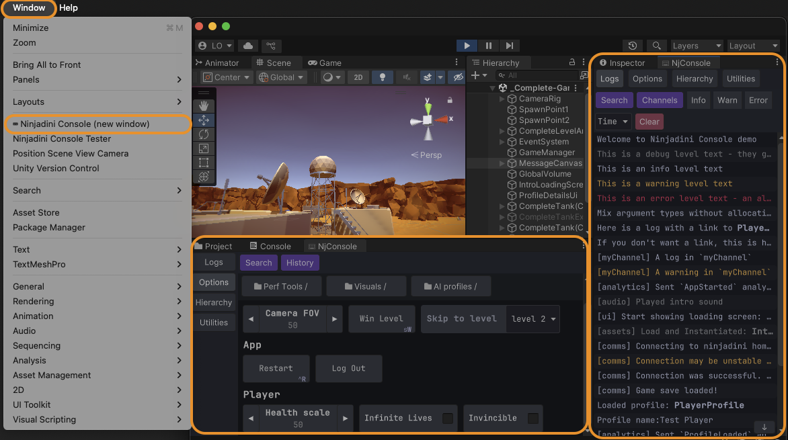

# 🚀 Getting Started with Ninjadini Debug Console

### ⚠️ Unity 2022.3 or newer is required   
NjConsole relies on Unity’s UI Toolkit, which became stable for runtime use in 2022.3 LTS.


### 🧩 Open console window in editor
- Navigate to: `Windows > ⌨ Ninjadini Console`
- You can open multiple console windows by selecting the menu again.



### 🕹️ Open console in game view
- **Keyboard:** Press the <code>`</code> key (top-left on US keyboard). Press again to close.
- **Mouse:** Hold at the top-left corner of the game screen for 1 second.
- **Mouse (alternative):** Double-tap the top-left corner of the screen.

You can customize these triggers in `Project Settings > Ninjadini ⌨ Console`.  
This is also where you can set a **passphrase challenge** to prevent unintended access.

#### 👀 Sidebar Tips (During Play Mode)
- Press and hold any empty area of the sidebar to temporarily peek behind the console.
- On screens with at least 650px width or height, a window mode button appears at the end of the sidebar — allowing you to undock and resize the console overlay.

<div class="page" />


# 📝 NjLogger

Unlike Debug.Log, which allocates memory and produces expensive stack traces, NjLogger:
- Avoids GC pressure with zero-allocation argument formatting
- Integrates seamlessly with NjConsole (filtering, channels, object inspection)
- Still captures logs from Debug.Log() to appear in NjConsole automatically

```
// These logs will appear in NjConsole with appropriate severity styling
NjLogger.Debug("This is a debug level text - they get auto excluded in release builds");
NjLogger.Info("This is an info level text");
NjLogger.Warn("This is a warning level text");
NjLogger.Error("This is an error level text - an alert shows when an error is logged.");
        
// Mixing types? No problem. This won't allocate.
NjLogger.Info("Mix argument types without allocation... integer:",123," float:", 123.45f," bool:", true);

// Link to objects for runtime inspection
var playerObj = GetTestPlayerObj();
NjLogger.Info("Here is a log with a link to ", playerObj.AsLogRef(), " - you can inspect it");

// Log object as plain string (no link)
NjLogger.Info("If you don't want a link, this is how... ", playerObj.AsString());

// Use named channels to group logs (recommended to keep as static readonly)
static readonly LogChannel channel = new LogChannel("myChannel");

channel.Info("A log in `myChannel`");
channel.Warn("A warning in `myChannel`");

// Unity's native logs still show up in NjConsole
Debug.Log("Logs from Unity’s Debug.Log() automatically appear in NjConsole");
```


## 🔍 Log filtering


NjConsole provides powerful filtering options to help you focus on the logs that matter:

- 🔤 **Text Search** Use multiple conditions to refine results.
  - `And` All conditions must match
  - `Or` At least one Or condition must match
  - `Not` Must not match to pass the filter
- 🧵 **Channels**
  - [ * ] Show all logs (no channel filtering)
  - [ - ] Show logs that have no channel assigned
- 🚦 **Log Levels**
  - Filter logs by severity: Info, Warn, Error


## 🔗 Logs object linking
You can include object references directly in your logs.  
When clicked, they open in the Object Inspector for quick inspection and editing.
```
var playerObj = GetTestPlayerObj();
NjLogger.Info("Here is a log with a link to ", playerObj);
NjLogger.Info("Here is a link to ", playerObj.AsLogRef(), " - mixed in multiple arguments");
```

When you click the log entry in the console, a button will appear for any linked object:  
   
Clicking the button opens the object in the inspector:  
  

> **♻️ Memory-Safe by Design**  
> Object links are held via weak references, so they won't cause memory leaks. However, if the object is garbage collected, the link may expire.  
> To retain the object for the log's lifetime (as long as it stays in the ring buffer), use a strong reference:  
> `NjLogger.Info("A strong object link:", aTestObj.AsStrongLogRef());`
  
> **⚠️ Limitations**  
> While you can view and modify many fields and properties, not all data types are fully editable (yet).

<div class="page" />


# 🛠️ Options Menu / Cheats

You can build interactive menus for in-game tools, debug settings, or cheat features — great for prototyping or QA workflows.


🧭 Two Ways to Add Options

## 🏷️ Add Option Items with \[ConsoleOption\] Attribute

You can easily register fields, properties or methods as menu items using the attribute.

Call this during setup to register all `[ConsoleOption]` entries on a class:
```
void Start()
{
        NjConsole.Options.CreateCatalogFrom(this, "TestOptions");
        // ^ second param `TestOptions` is optional, it puts all the items inside the `TestOptions` folder in this example.
        // If 'this' is a MonoBehaviour, options will auto-remove when `OnDestroy()`
}
```

### 🔘 Buttons
```
[ConsoleOption]
void SayHello() {
        Debug.Log("Hello");
}

// directory / folder
[ConsoleOption("ChildFolder/My Second Button")]
void AnotherButton() {
        Debug.Log("Clicked my second [ConsoleOption] button");
}

// header
[ConsoleOption("A button inside a header", 
                header:"My Header")]
void AButtonInsideHeader() {
        Debug.Log("Clicked my second [ConsoleOption] button");
}

// key binding - Shift + W to call WinLevelCheat() in playmode
[ConsoleOption(key:Key.W, 
                keyModifier:ConsoleKeyBindings.Modifier.Shift)]
void WinLevelCheat() {
        Debug.Log("Clicked WinLevelCheat");
}

// auto close console overlay
[ConsoleOption(autoClose:true)]
void AutoCloseConsole() {
        Debug.Log("Console overlay should be closed now that you clicked a button with auto close flag");
}
```

### ✅ Toggles
```
[ConsoleOption()]
bool InfiniteLives;

[ConsoleOption()]
bool InfiniteAmmo {get; set;}
```
> Warning: Keybinding feature only works for buttons and toggles.

### 🔢 Numbers
```
[ConsoleOption]
int Health;

[ConsoleOption]
int HealthProperty {get; set;}

// With left and right step buttons
[ConsoleOption(increments:0.5f)]
float Speed;

// Range clamping
[ConsoleOption()]
[Range(1, 5)] // FYI: If you use a version before Unity 6, RangeAttribute can not be used in properties
int Strength;
```

### 🔢 Text fields
```
[ConsoleOption]
[Multiline] // if you need multiline text entry, put [Multiline] attribute. 
string UserCommentMessage;

[ConsoleOption]
void SaySomething(string receivedText)
{
        Debug.Log("You said: " + receivedText);
}
```

### 🔽 Enum Dropdown
```
[ConsoleOption]
DeviceOrientation preferredOrientation;
```

---

## 🧩 Add Option Items Programmatically

Use this method for full control and dynamic setup.

```var catalog = NjConsole.Options.CreateCatalog();```
> Catalogs are useful because when you no longer need a set of option menus, you can just call `catalog.RemoveAll()`.  

### 🔘 Buttons
```
catalog.AddButton("My First Button", () => Debug.Log("Clicked my first button"));

// directory / folder
catalog.AddButton("A Folder / Child Folder / Child Button", () => Debug.Log("Child button was clicked"));

// header sub-grouping
catalog.AddButton("A button in a header sub-group", () => {})
        .SetHeader("My Header");

// key binding to space key
catalog.AddButton("My Space Key Bound Button", () => Debug.Log("Clicked my Space key bound button"))
        .BindToKeyboard(KeyCode.Space);

// auto close console overlay
catalog.AddButton("My auto close button", () => Debug.Log("Console overlay should be closed now that you clicked a button with auto close flag"))
        .AutoCloseOverlay();
```


### ✅ Toggles
```
var toggle1 = false;
var toggle2 = false;

catalog.AddToggle("My First Toggle", (v) => toggle1 = v, () => toggle1);

// folder + key binding + auto close
catalog.AddToggle("A Folder / My T key Bound Toggle", (v) => toggle2 = v, () => toggle2);
        .BindToKeyboard(KeyCode.T)
        .AutoCloseOverlay();
```

> Both buttons and toggles can be bound to a keyboard key via `...BindToKeyboard(KeyCode.Space)`.  
> Shift + Ctrl + E style combo can be done via `...BindToKeyboard(KeyCode.E, ConsoleKeyBindings.Modifier.Shift | ConsoleKeyBindings.Modifier.Ctrl)`.  
> ⚠️ Only one keybinding per item.  
>    
> Set console overlay to auto close after you press the button via `...AutoCloseOverlay()`.  


### 🔢 Numbers
```
var aFloat = 12.34f;
catalog.AddNumberPrompt("A Number", (v) => aFloat= v, () => aFloat);

// clamped int number
var int0To100 = 50;
catalog.AddNumberPrompt("0 to 100", (v) => int0To100 = Mathf.Clamp(v, 0, 100), () => int0To100);

// Number prompt with left and right step buttons
var steppedNumber = 10;
catalog.AddNumberPrompt("Stepped number", (v) => steppedNumber = v, () => steppedNumber, 2);
```

### 🔢 Text fields
```
var text = "Initial text";
catalog.AddTextPrompt("My Text Prompt", (v) => text = v, () => text);

// Text prompt with submission validation and input restriction
var text2 = "Initial text";
catalog.AddTextPromptWithValidation("My validated text", 
  getter: () => text2, 
  setter: v => {
        if(v.All(char.IsUpper)) // in this example we only accept capital letters
        {
                text2 = v;
                return true; // return true to accept the input and close the prompt.
        }
        return false; // Return false to block user from closing the dialog due to invalid value.
  },
  validator: (v) => {
        if (v.Length > 5) v = v.Substring(0, 5); // Trim out invalid characters (or length) and return the valid version (optional)
        return v;
  } );
```

### 🔽 Dropdown choices
```
var choices = new List<string>() { "A", "B", "C", "D" };
var index = 0;
catalog.AddChoice("A Choice List", choices, () => index, (v) => index = v);

// An enum choice:
var platform = RuntimePlatform.OSXEditor;
options.AddEnumChoice("A Choice Enum", () => platform, (v) => platform = v);

```
> 💡 Use grouped paths (like "Category / Subgroup / Option") to keep menus organized and easier to navigate:  
> `catalog.AddButton("App / Utilities / Reload Scene", () => ReloadScene());`


## 🤔 Should You Use \[ConsoleOption\] or Add Programmatically?

**Use \[ConsoleOption\] when:**  
- You want a quick and declarative way to expose instance values and methods
- You want automatic cleanup when the object is destroyed (MonoBehaviour only)

**Use programmatic registration when:**  
- You want fine-grained control over when and how options appear
- You want slightly faster setup (bypassing reflection)
- You need dynamic options (e.g. buttons generated per inventory item):  
```
foreach (var itemType in inventoryItemTypes)
{
        var local = itemType;
        catalog.AddButton("Inventory/Give " + itemType.Name, () => GiveItem(local));
}
```

<div class="page" />


## 🎯 Shortcuts

You can create runtime shortcut buttons for quick access to options.
> **Note:** Shortcuts are available only in runtime overlay mode, not in the editor window.


### 📌 How to Create a Shortcut
- Press and hold on any option item or folder in the options menu.
- Drag it to a screen corner to create a shortcut.

Shortcuts will align to one of four corners:
- Items fill horizontally or vertically based on your drag position.
- For example: top-left corner can fill right or down depending on where you drop.

### ✏️ Shortcut Edit Mode
Once you drop your first shortcut, you’ll enter shortcut edit mode:
- 🟦 Drag & drop existing items to reposition them.
- 🔁 Switch between 3 different shortcut layouts (slots 1–3).
- ⚙️ Toggle Auto Show at Start to display shortcuts on game launch.
- 🧠 Shortcuts sync with menu visibility — they appear/disappear as the linked options do.
- 🫥 If you pressed `hide shortcuts`, use: Console > Options > Show Shortcuts to reopen edit mode.

<div class="page" />


# 🚀 Ready for More?

📘 For advanced topics such as:
- Creating custom modules and panels
- Building editor-bound options menus
- Accessing log history and writing custom log handlers
- Customizing log timestamp formats
- Creating shortcut-style overlays (e.g. FPS monitor)
- Setting up access challenges
- Tailoring player builds by enabling/disabling features  

...and more!

👉 Refer to the online manual for full documentation:  
[https://ninjadini.github.io/njconsole/](https://ninjadini.github.io/njconsole/)
