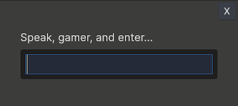

# Console Window


## 🧩 Open console window in editor
- Navigate to: `Windows > ⌨ Ninjadini Console`
- You can open multiple console windows by selecting the menu again.


## 🕹️ Open console in game view
- **Keyboard:** Press the <code>`</code> key (top-left on US keyboard). Press again to close.
- **Mouse:** Hold at the top-left corner of the game screen for 1 second.
- **Mouse (alternative):** Double-tap the top-left corner of the screen.

You can customize these triggers in `Project Settings > Ninjadini ⌨ Console`.  

### 👀 Sidebar Tips (During Play Mode)
- Press and hold any empty area of the sidebar to temporarily peek behind the console.
- On screens with at least 650px width or height, a window mode button appears at the end of the sidebar — allowing you to undock and resize the console overlay.


## 🔐 Setting up Access Challenge
You can configure an access challenge to prevent unintended access to the console.
1. Go to Project Settings → Ninjadini ⌨ Console → Playmode Overlay → Access Challenge
2. Click `Add Access Challenge`
3. Select `Secret Pass`
4. Set a passcode and (optionally) a hint message
5. Press `Apply changes`
6. A passcode prompt will appear when you attempt to activate the console overlay - in play mode



# 🔧 Advanced topics

## ⚡ Auto start console
- Console overlay is set to auto start in play mode by default
- If you have set up activation triggers (<code>`</code>key press or hold at corner) it will stay hidden till it is activated

You can disable auto start via `Project Settings > Ninjadini ⌨ Console > Playmode Overlay`  
To manually start the console overlay, call `NjConsole.Overlay.EnsureStarted()`  
This will start hidden if you have activation triggers set up.  
If you want to force show the console overlay, call `NjConsole.Overlay.ShowWithAccessChallenge()`  

## 🕹️ Setting up your own activation trigger
You can have your own custom way to trigger the console overlay in play mode.  
The default triggers are done via ConsoleKeyPressTrigger and ConsolePressAndHoldTrigger, you can refer to them as example.  

1. Create a class that implements both IConsoleAccessChallenge and IConsoleExtension.  
2. Add [Serializable] attribute to the class.  
3. Go to `Project Settings > NjConsole > Playmode Overlay > Add Trigger` > add your new class   
4. Press `Apply changes`
Example code below toggles the overlay on shift + right mouse click.
```
[System.Serializable]
public class ShiftRightClickConsoleTrigger : IConsoleOverlayTrigger, IConsoleExtension
{
    ConsoleOverlay _overlay;
    public void ListenForTriggers(ConsoleOverlay overlay)
    {
        _overlay = overlay;
        overlay.schedule.Execute(Update).Every(1);
    }

    void Update()
    {
        // using old input manager...
        if (Input.GetMouseButtonDown(1) && (Input.GetKey(KeyCode.LeftShift) || Input.GetKey(KeyCode.RightShift))) {
            _overlay.Toggle();
        }
    }
}
```


## 🔐 Setting up your own custom access challenge type
You may want to set up your own access challenge, perhaps maybe tie it into your own login system.  

1. Create a class that implements both IConsoleAccessChallenge and IConsoleExtension.  
2. Add [Serializable] attribute to the class.  
3. Go to `Project Settings > NjConsole > Playmode Overlay > Add Access Challenge` > add your new class  
Example code below ask for a simple math question to answer before letting you go to console.
```
[System.Serializable]
public class MathsAccessChallenge : IConsoleAccessChallenge, IConsoleExtension
{
    static bool _passed; // should be store in player pref or something

    public bool ShowingChallenge { get; private set; }

    void IConsoleModule.OnAdded(ConsoleModules console)
    {
        _passed = false;
        ShowingChallenge = false;
    }

    public bool IsAccessChallengeRequired()
    {
        return !_passed;
    }

    public void ShowChallenge(Action callbackOnSuccess)
    {
        ShowingChallenge = true;
        var numA = UnityEngine.Random.Range(1, 100);
        var numB = UnityEngine.Random.Range(1, 100);
        // This could be anything, like your own sign in dialog. We are just using the text prompt from Console for simplicity.
        ConsoleTextPrompt.Show(new ConsoleTextPrompt.Data()
        {
            Title = $"{numA} + {numB} = ?",
            ResultCallback = (response) =>
            {
                if (response == null) // user pressed close btn
                {
                ShowingChallenge = false;
                return true;
                }
                if (int.TryParse(response, out var responseInt) && responseInt == numA + numB)
                {
                ShowingChallenge = false;
                _passed = true;
                callbackOnSuccess();
                return true;
                }
                return false;
            }
        });
    }
}
```


[NjConsole doc home](index.md)