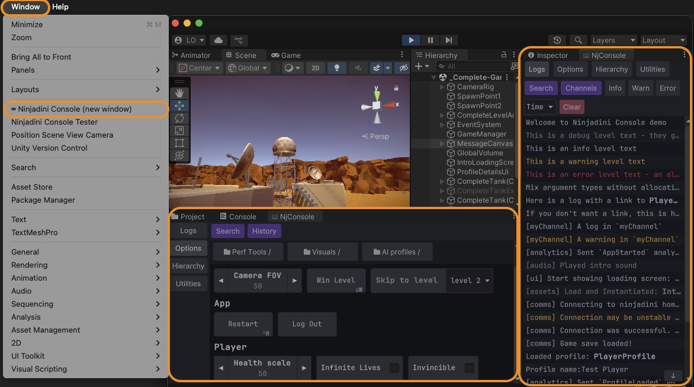
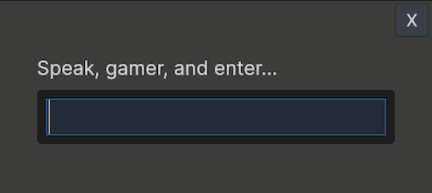

# Console Window


## 🧩 Open console window in editor
- Navigate to: `Window > ⌨ Ninjadini Console (new window)`
- Select it again to open another window — you can have several open at once.
- Right-click a GameObject in Unity's Hierarchy → `Inspect in ⌨ NjConsole` opens it straight in the
  console's Object Inspector.



## 🕹️ Open console in game view
- **Keyboard:** Press the <code>`</code> key (top-left on US keyboard). Press again to close.
- **Keyboard:** `Shift` + <code>`</code> opens the console straight into the Command Line prompt.
- **Mouse:** Hold at the top-left corner of the game screen for 1 second.
- **Mouse (alternative):** Double-tap the top-left corner of the screen.

You can customize these triggers in `Project Settings > Ninjadini ⌨ Console > Playmode Overlay`.  

### 👀 Sidebar Tips (During Play Mode)
- Press and hold any empty area of the sidebar to temporarily peek behind the console.
- On screens 650px or wider (or taller), a window mode button at the end of the sidebar lets you undock and resize the overlay.

## 🧭 The panels

| Panel | What it does | Docs |
|---|---|---|
| **Logs** | Log viewer, filtering, search, and the Command Line | [Logging](logging.md), [Command Line](commandline.md) |
| **Options** | Your cheats / debug menu, plus shortcuts | [Options Menu](optionsmenu.md) |
| **Hierarchy** | Live scene tree — drill into GameObjects and their components | [Inspector & Utilities](inspector.md) |
| **Utilities** | FPS/memory monitors, PlayerPrefs, editable screen & quality settings, device info, log export, UI scale | [Inspector & Utilities](inspector.md) |
| **Editor Options** | Options that work outside play mode (editor window only) | [Options Menu](optionsmenu.md#️-editor-only-options) |

Every panel except Logs can be switched off for player builds under `... > Features`, and you can add your
own — see [Custom Panels](custompanels.md).


## 🔐 Setting up Access Challenge
Gate the console behind a passcode:
1. Go to Project Settings → Ninjadini ⌨ Console → Playmode Overlay → Access Challenge
2. Click `Add Access Challenge`
3. Select `Secret Pass`
4. Set a passcode and (optionally) a hint message
5. Press `Apply changes`
6. Activating the overlay in play mode now prompts for the passcode



# 🔧 Advanced topics

## ⚡ Auto start console
The overlay auto-starts in play mode. With activation triggers set up (<code>`</code> key, hold at corner) it
stays hidden until one fires.

Disable auto start under `Project Settings > Ninjadini ⌨ Console > Playmode Overlay`, then start it yourself
with `NjConsole.Overlay.EnsureStarted()` — which also starts hidden if you have triggers. To force it open,
`NjConsole.Overlay.ShowWithAccessChallenge()`.

## 🕹️ Setting up your own activation trigger
Roll your own way to open the overlay in play mode. `ConsoleKeyPressTrigger` and `ConsolePressAndHoldTrigger`
are the built-in examples to crib from.

1. Create a class that implements both `IConsoleOverlayTrigger` and `IConsoleExtension`.  
2. Add [Serializable] attribute to the class.  
3. Go to `Project Settings > Ninjadini ⌨ Console > Playmode Overlay > Add Trigger` > add your new class   
4. Press `Apply changes`

Example code below toggles the overlay on shift + right mouse click.
```csharp
[System.Serializable]
public class ShiftRightClickConsoleTrigger : IConsoleOverlayTrigger, IConsoleExtension
{
    ConsoleOverlay _overlay;
    public void ListenForTriggers(ConsoleOverlay overlay)
    {
        _overlay = overlay;
        overlay.schedule.Execute(Update).Every(1);
    }

    void Update()
    {
        // using old input manager...
        if (Input.GetMouseButtonDown(1) && (Input.GetKey(KeyCode.LeftShift) || Input.GetKey(KeyCode.RightShift))) {
            if (_overlay.Showing) {
                _overlay.Hide();
            } else {
                _overlay.ShowWithAccessChallenge();
            }
        }
    }
}
```
> Use `ShowWithAccessChallenge()` rather than `ShowWithoutAccessChallenge()`, so a configured challenge still applies.


## 🔐 Setting up your own custom access challenge type
Tie the gate into your own login system, or anything else.

1. Create a class that implements both IConsoleAccessChallenge and IConsoleExtension.  
2. Add [Serializable] attribute to the class.  
3. Go to `Project Settings > Ninjadini ⌨ Console > Playmode Overlay > Add Access Challenge` > add your new class  
4. Press `Apply changes`

This one asks a maths question before letting you in.
```csharp
[System.Serializable]
public class MathsAccessChallenge : IConsoleAccessChallenge, IConsoleExtension
{
    static bool _passed; // persist this in PlayerPrefs or similar

    public bool ShowingChallenge { get; private set; }

    void IConsoleModule.OnAdded(ConsoleModules console)
    {
        _passed = false;
        ShowingChallenge = false;
    }

    public bool IsAccessChallengeRequired()
    {
        return !_passed;
    }

    public void ShowChallenge(Action callbackOnSuccess)
    {
        ShowingChallenge = true;
        var numA = UnityEngine.Random.Range(1, 100);
        var numB = UnityEngine.Random.Range(1, 100);
        // This could be anything, like your own sign in dialog. We are just using the text prompt from Console for simplicity.
        ConsoleTextPrompt.Show(new ConsoleTextPrompt.Data()
        {
            Title = $"{numA} + {numB} = ?",
            ResultCallback = (response) =>
            {
                if (response == null) // user pressed close btn
                {
                    ShowingChallenge = false;
                    return true;
                }
                if (int.TryParse(response, out var responseInt) && responseInt == numA + numB)
                {
                    ShowingChallenge = false;
                    _passed = true;
                    callbackOnSuccess();
                    return true;
                }
                return false; // returning false keeps the prompt open
            }
        });
    }
}
```


## 🎛️ Controlling the overlay from code

```csharp
NjConsole.Overlay.EnsureStarted();          // start it, hidden, waiting for triggers
NjConsole.Overlay.ShowWithAccessChallenge();// show, running the access challenge first
NjConsole.Overlay.Show();                   // show, skipping the access challenge
NjConsole.Overlay.Hide();
NjConsole.Overlay.Showing;                  // bool

NjConsole.Overlay.SetActivePanel<ConsoleOptions>();   // or by Type, or by panel name string
NjConsole.Overlay.ActivePanel;
NjConsole.Overlay.Context;                  // the ConsoleContext for this overlay
NjConsole.Overlay.Destroy();
```
All safe no-ops when NjConsole is stripped with `NJCONSOLE_DISABLE` — see [Build customization](buildcustomization.md).

[NjConsole doc home](index.md)