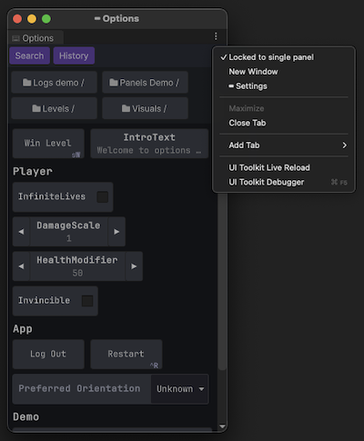

# Add custom panel (UIToolkit format)

A demo panel code:
```
public class DemoPanelModule : IConsolePanelModule
{
 public string Name => "DemoPanel"; // Name to display on the side panel

 public float SideBarOrder => 12; // The order of the button to appear on the side panel

 public VisualElement CreateElement(ConsoleContext context)
 {
     // Create the VisualElement for the panel - this is for that specific ConsoleContext.
     // Remember you can have multiple editor console windows and at runtime too.
     // The context will be unique per window.
     return new BasicDemoPanel();
 }
}

class BasicDemoPanel : VisualElement
{
    public BasicDemoPanel()
    {
        AddToClassList("panel"); // just adds a background
        Add(new Label("Hello from demo panel"));
    }
}
```

2 ways to register to console.

a. Manually add the panel at runtime by code:  
```
if(NjConsole.Modules.GetModule(typeof(DemoPanelModule)) == null){
    NjConsole.Modules.AddModule(new DemoPanelModule()); 
}
```

b. Add via IConsoleExtension:
 1. Add IConsoleExtension interface to your panel module class.
 2. Add [Serializable] attribute to the class.  
 3. Go to `Project Settings > NjConsole > Extension Modules > Add Extension Module` > add your new class 
 4. Press `Apply changes`

# Add custom panel (OnGUI / IMGUI format)

Alternatively, you can also add your panel using OnGUI rendering.  
```
public class DemoOnGUIPanelModule : IConsoleIMGUIPanelModule
{
   public string Name => "OnGUI";

   public float SideBarOrder => 12;

   public IConsoleIMGUI CreateIMGUIPanel(ConsoleContext context)
   {
      // Each ConsoleContext is a different ui window, so we need different instance per window.
      return new BasicOnGUIDemoPanel();
   }
}

class BasicOnGUIDemoPanel : IConsoleIMGUI
{
   public void OnGUI()
   {
      GUILayout.Label("Hello from OnGUI");
   }
}
```

# Panels for Edit mode (both in and out of play mode)

You can easly make panels that can show outside the play mode.  
Perhaps you are looking into migrating your existing tools into NjConsole panels so that it is easier to find.  
Alternatively, consider migrating some of your editor tools to work in play mode panels too.

In short, `IConsoleModule > PersistInEditMode` determines if the module is cleaned up after play mode.  

All you need to do is add the module when you want it in editor.  
Here is an example to add your `Uber` editor panel at editor start up:
```
[InitializeOnLoad]
public class MyUberEditorPanel : IConsolePanelModule
{
    static MyUberEditorPanel()
    {
        // Register the module at editor [InitializeOnLoad]
        NjConsole.Modules.AddModule(new MyUberEditorPanel());
    }
    
    public bool PersistInEditMode => true; // Ensure module is persisted between play mode changes (depends on your  domain reload setting)

    public string Name => "UberPanel"; // Name to display on the side panel

    public float SideBarOrder => 15; // The order of the button to appear on the side panel

    public VisualElement CreateElement(ConsoleContext context)
    {
        // Create the VisualElement for the panel - this is for that specific ConsoleContext.
        // Remember you can have multiple editor console windows and at runtime too.
        // The context will be unique per window.
        return new MyUberEditorPanelElement();
    }
}

class MyUberEditorPanelElement : VisualElement
{
    public MyUberEditorPanelElement()
    {
        AddToClassList("panel"); // just adds a background
        Add(new Label("Hello from MyUberEditorPanelElement"));
    }
}
```

# Lock editor console window to a single panel

You may want to have multiple console windows open with each set to a specific panel for easy access.  
This should allow you to migrate your existing editor tools to NjConsole panel while keeping the old way to access it.

Here is how it looks:  


Using the previous UberPanel example, you can make a menu item to open your panel directly and lock it:
```
[MenuItem("Tools/Create Uber Panel")]
public static void CreateUberPanel()
{
    // Ensure the module exists.
    if (NjConsole.Modules.GetModule(typeof(MyUberEditorPanel)) == null)
    {
        NjConsole.Modules.AddModule(new MyUberEditorPanel());
    }

    // Create and show the console editor window.
    var window = NjConsoleEditorWindow.CreateWindow();
    
    // Set console panel to show MyUberEditorPanel
    window.Window.SetActivePanel<MyUberEditorPanel>();
    
    // lock to single panel (you can always unlock it from the window context menu - top right tripple dot)
    window.SetLockedToSinglePanel(true);
}
```

[NjConsole doc home](index.md)