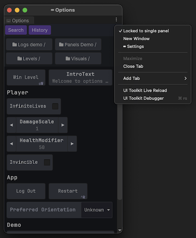

# Add custom panel (UIToolkit format)

A demo panel code:
```csharp
public class DemoPanelModule : IConsolePanelModule
{
 public string Name => "DemoPanel"; // Name to display on the side panel

 public float SideBarOrder => 12; // The order of the button to appear on the side panel

 public VisualElement CreateElement(ConsoleContext context)
 {
     // Create the VisualElement for the panel - this is for that specific ConsoleContext.
     // Remember you can have multiple editor console windows and at runtime too.
     // The context will be unique per window.
     return new BasicDemoPanel();
 }
}

class BasicDemoPanel : VisualElement
{
    public BasicDemoPanel()
    {
        AddToClassList("panel"); // just adds a background
        Add(new Label("Hello from demo panel"));
    }
}
```

`SideBarOrder` is a plain sort order — a `float`, so you can slot in between the built-in panels:

| Panel | Order |
|---|---|
| Logs | 1 |
| Options | 2 |
| Hierarchy | 3 |
| Utilities | 4 |
| Editor Options | 5 |

So `2.5` puts your panel between Options and Hierarchy.

### Optional members

```csharp
// Hide the panel without removing the module (e.g. gated on a build flag or a server switch)
public bool PanelFeatureEnabled => MyGame.IsInternalBuild;

// Replace the sidebar button entirely
public VisualElement CreateSideButton(ConsoleContext context, Action clickedCallback) { ... }
```
Your panel **element** can implement `IConsolePanelModule.IElement` to hear the sidebar button being clicked
while your panel is already open — usually a cue to reset:
```csharp
class BasicDemoPanel : VisualElement, IConsolePanelModule.IElement
{
    public void OnReselected() => ResetToTop();
}
```

2 ways to register to console.

a. Manually add the panel at runtime by code:  
```csharp
if(NjConsole.Modules.GetModule(typeof(DemoPanelModule)) == null){
    NjConsole.Modules.AddModule(new DemoPanelModule()); 
}
```

b. Add via IConsoleExtension:
 1. Add IConsoleExtension interface to your panel module class.
 2. Add [Serializable] attribute to the class.  
 3. Go to `Project Settings > Ninjadini ⌨ Console > Extension Modules > Add Extension Module` > add your new class 
 4. Press `Apply changes`

# Add custom panel (OnGUI / IMGUI format)

Alternatively, you can also add your panel using OnGUI rendering.  
```csharp
public class DemoOnGUIPanelModule : IConsoleIMGUIPanelModule
{
   public string Name => "OnGUI";

   public float SideBarOrder => 12;

   public IConsoleIMGUI CreateIMGUIPanel(ConsoleContext context)
   {
      // Each ConsoleContext is a different ui window, so we need different instance per window.
      return new BasicOnGUIDemoPanel();
   }
}

class BasicOnGUIDemoPanel : IConsoleIMGUI
{
   public void OnGUI()
   {
      GUILayout.Label("Hello from OnGUI");
   }
}
```

# Panels for Edit mode (both in and out of play mode)

Panels can show outside play mode too — handy for pulling your existing editor tools somewhere easier to find,
or for making them work in play mode as well.

`IConsoleModule > PersistInEditMode` decides whether the module is cleaned up after play mode. Beyond that you
just add the module when you want it. Registering an `Uber` editor panel at editor start up:
```csharp
[InitializeOnLoad]
public class MyUberEditorPanel : IConsolePanelModule
{
    static MyUberEditorPanel()
    {
        // Register the module at editor [InitializeOnLoad]
        NjConsole.Modules.AddModule(new MyUberEditorPanel());
    }
    
    public bool PersistInEditMode => true; // Ensure module is persisted between play mode changes (depends on your  domain reload setting)

    public string Name => "UberPanel"; // Name to display on the side panel

    public float SideBarOrder => 15; // The order of the button to appear on the side panel

    public VisualElement CreateElement(ConsoleContext context)
    {
        // Create the VisualElement for the panel - this is for that specific ConsoleContext.
        // Remember you can have multiple editor console windows and at runtime too.
        // The context will be unique per window.
        return new MyUberEditorPanelElement();
    }
}

class MyUberEditorPanelElement : VisualElement
{
    public MyUberEditorPanelElement()
    {
        AddToClassList("panel"); // just adds a background
        Add(new Label("Hello from MyUberEditorPanelElement"));
    }
}
```

# Lock editor console window to a single panel

Open several console windows, each locked to one panel — so your migrated editor tools keep a direct entry
point of their own.




Using the previous UberPanel example, you can make a menu item to open your panel directly and lock it:
```csharp
[MenuItem("Tools/Create Uber Panel")]
public static void CreateUberPanel()
{
    // Ensure the module exists.
    if (NjConsole.Modules.GetModule(typeof(MyUberEditorPanel)) == null)
    {
        NjConsole.Modules.AddModule(new MyUberEditorPanel());
    }

    // Open a new console editor window (use GetOrCreateWindow() to reuse an existing one instead).
    var window = NjConsoleEditorWindow.CreateWindow();
    
    // Set console panel to show MyUberEditorPanel
    window.Window.SetActivePanel<MyUberEditorPanel>();
    
    // lock to single panel (unlock it any time from the window context menu - top right triple dot)
    window.SetLockedToSinglePanel(true);
}
```

[NjConsole doc home](index.md)