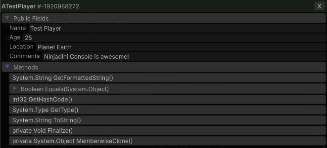

# 🔍 Object Inspector

The shared view for looking at — and editing — a live object. It opens from several places:

- Clicking an object link in a [log](logging.md#-logs-object-linking)
- Clicking a GameObject or component in the **Hierarchy** panel
- Right-clicking a GameObject in Unity's own Hierarchy → `Inspect in ⌨ NjConsole` (Editor only)
- `/inspect` in the [Command Line](commandline.md)
- `Utilities > Tools > Types inspector`, to reach static members of any loaded type
- From your own code: `Ninjadini.Console.UI.ConsoleInspector.Show(someContainerElement, myObject);`



- **Read and edit** fields and properties. Types that aren't supported yet show read-only.
- **Follow references** into nested objects; `◀` walks back.
- **Call methods**, including ones taking parameters.
- **View static members** via the `View static members >` button.
- **`Types`** — search loaded assemblies for any type to inspect its statics.
- **`⌨`** — send the object to the Command Line as the current scope, ready for `/call`, `/store` and the
  rest. See [Accessing Logged Objects](commandline.md#-accessing-logged-objects).

> **Auto read properties** — the toggle at the top. Reading a property can have side effects
> (`Renderer.material` duplicates the `sharedMaterial`), so some aren't read until you ask.

> `Features > In Player Object Inspector` turns it off for player builds — that switch also covers log object
> links, hierarchy component detail, and the type search.

---

# 📂 Hierarchy panel

A live view of the scene tree, `DontDestroyOnLoad` included. Expand through children, then click a GameObject
to open it in the Object Inspector and edit its components while the game runs — which is the point when
you're on a device and the Editor's own hierarchy isn't there.

---

# 🧰 Utilities panel

<div markdown="1">

### Tools

| Button | What it does |
|---|---|
| `UI Scale + / -` | Resize the runtime overlay. The fix for a wrongly-detected device DPI — see [Troubleshooting](troubleshooting.md) |
| `SafeArea + / -` | Nudge the safe-area inset. Only appears in the runtime overlay on a device that actually reports a safe area |
| `FPS Monitor` | Toggle the floating FPS graph. Click it to flip between `fps` and `ms`; right-click to collapse / expand |
| `Memory Monitor` | Toggle the floating memory graph. Click to force a GC, double-click to unload unused assets, triple-click to collapse / expand |
| `GC Collect` | Force a garbage collection now |
| `Resources UnloadUnused` | `Resources.UnloadUnusedAssets()` |
| `Copy / Email / Export Text Logs` | Dump the log history. Customize the contents with `IConsoleLogExportFormatter` — see [Logging](logging.md#-customize-the-exported--emailed-logs) |
| `Types inspector` | Search loaded types and inspect their static members. Hidden when the Object Inspector is disabled for the build |

### Player Prefs
Type a key to read, edit or delete its value (int / float / string), or `Delete All`. Keys you've viewed are
kept in a history dropdown.

Unity can't enumerate PlayerPrefs keys at runtime, so supply your own list for the dropdown:
```csharp
NjConsole.Settings.PlayerPrefKeysProvider = () => new List<string> { "playerName", "musicVolume", ... };
```

### Info screens
**App Info**, **Screen Info**, **Device Info**, **QualitySettings**, **Graphics Info**,
**Other SystemInfo** and **About** — handy in a bug report from a device.

Not all of it is read-only. Anything with a setter can be changed live, which makes these a quick way to
reproduce a device-specific problem without rebuilding:

| Screen | What you can change |
|---|---|
| **Screen Info** | `width` / `height` (applies via `Screen.SetResolution`), `fullScreen`, `fullScreenMode`, `orientation`, `brightness`, `sleepTimeout`, `targetFrameRate` |
| **QualitySettings** | Quality level, vSync, anti-aliasing, anisotropic filtering, shadow quality / distance / cascades / projection, LOD bias, pixel light count, particle raycast budget, mipmap streaming, async upload |
| **App Info** | `targetFrameRate` |
| **Device Info**, **Graphics Info**, **Other SystemInfo** | Read-only — straight `SystemInfo` dumps |

Read-only values within an editable screen (`Screen.dpi`, `currentResolution`, `safeArea`, `activeColorSpace`)
just render as text.

> Resizing via `Screen.width` / `Screen.height` only works in the **runtime overlay** — the editor window
> shows "See in runtime overlay" instead, since resizing the Game view from there isn't meaningful.

> **Show all** at the bottom of App Info, Screen Info and QualitySettings opens the whole type in the
> Object Inspector, where you can reach everything else on it. Some properties won't show in a player build
> due to native binding.

</div>

> `Features > In Player Utilities Panel` disables the whole panel for player builds.

[NjConsole doc home](index.md)
