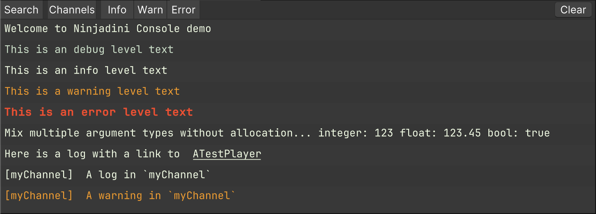
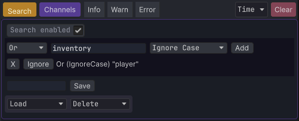
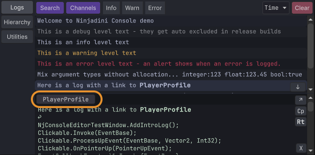
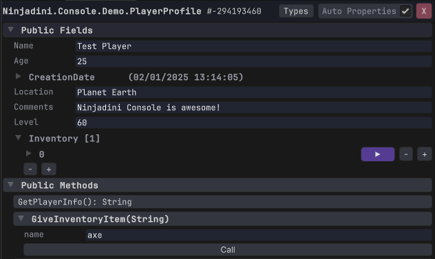

# 📝 NjLogger & Logs panel

Unlike Debug.Log, which allocates memory and produces expensive stack traces, NjLogger:
- Avoids GC pressure with zero-allocation argument formatting
- Integrates seamlessly with NjConsole (filtering, channels, object inspection)
- Still captures logs from Debug.Log() to appear in NjConsole automatically

```
// These logs will appear in NjConsole with appropriate severity styling
NjLogger.Debug("This is a debug level text - they get auto excluded in release builds");
NjLogger.Info("This is an info level text");
NjLogger.Warn("This is a warning level text");
NjLogger.Error("This is an error level text - an alert shows when an error is logged.");
        
// Mixing types? No problem. This won't allocate.
NjLogger.Info("Mix argument types without allocation... integer:",123," float:", 123.45f," bool:", true);

// Link to objects for runtime inspection
var playerObj = GetTestPlayerObj();
NjLogger.Info("Here is a log with a link to ", playerObj.AsLogRef(), " - you can inspect it");

// Log object as plain string (no link)
NjLogger.Info("If you don't want a link, this is how... ", playerObj.AsString());

// Use named channels to group logs (recommended to keep as static readonly)
static readonly LogChannel channel = new LogChannel("myChannel");

channel.Info("A log in `myChannel`");
channel.Warn("A warning in `myChannel`");

// Unity's native logs still show up in NjConsole
Debug.Log("Logs from Unity’s Debug.Log() automatically appear in NjConsole");
```



## 🔍 Log filtering



NjConsole provides powerful filtering options to help you focus on the logs that matter:

- 🔤 **Text Search** Use multiple conditions to refine results.
  - `And` All conditions must match
  - `Or` At least one Or condition must match
  - `Not` Must not match to pass the filter
- 🧵 **Channels**
  - [ * ] Show all logs (no channel filtering)
  - [ - ] Show logs that have no channel assigned
- 🚦 **Log Levels**
  - Filter logs by severity: Info, Warn, Error


## 🔗 Logs object linking
You can include object references directly in your logs.  
When clicked, they open in the Object Inspector for quick inspection and editing.
```
var playerObj = GetTestPlayerObj();
NjLogger.Info("Here is a log with a link to ", playerObj);
NjLogger.Info("Here is a link to ", playerObj.AsLogRef(), " - mixed in multiple arguments");
```

When you click the log entry in the console, a button will appear for any linked object:  
   
Clicking the button opens the object in the inspector:  
  

> **♻️ Memory-Safe by Design**  
> Object links are held via weak references, so they won't cause memory leaks. However, if the object is garbage collected, the link may expire.  
> To retain the object for the log's lifetime (as long as it stays in the ring buffer), use a strong reference:  
> `NjLogger.Info("A strong object link:", aTestObj.AsStrongLogRef());`
  
> **⚠️ Limitations**  
> While you can view and modify many fields and properties, not all data types are fully editable (yet).


[NjConsole doc home](index.md)