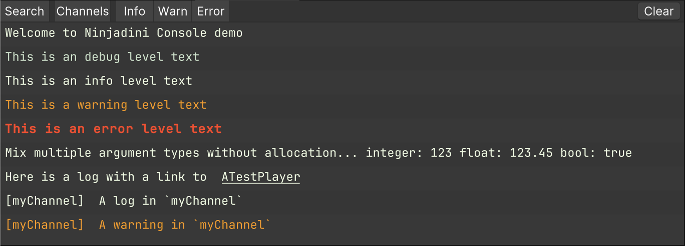
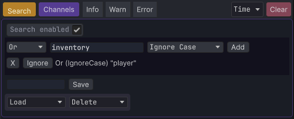
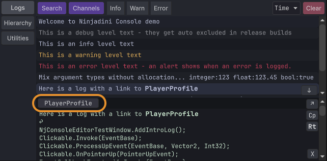

# 📝 NjLogger & Logs panel

## 📘 NjLogger basics
A drop-in alternative to `Debug.Log`, which allocates and captures a costly stack trace on every call. NjLogger:
- Formats arguments with zero allocations
- Integrates with NjConsole's filtering, channels and object inspection
- Still captures `Debug.Log()` automatically — no setup needed

```csharp
// These logs will appear in NjConsole with appropriate severity styling
NjLogger.Debug("This is a debug level text - they get auto excluded in release builds");
NjLogger.Info("This is an info level text");
NjLogger.Warn("This is a warning level text");
NjLogger.Error("This is an error level text - an alert shows when an error is logged.");
NjLogger.Exception(exception, "Optional message to go with the exception");

// NjLogger.Log() is an alias of Info(), there so it reads like Unity's Debug.Log()
NjLogger.Log("Same as NjLogger.Info()");

// Mixing types? No problem. This won't allocate.
NjLogger.Info("Mix argument types without allocation... integer:",123," float:", 123.45f," bool:", true);

// Link to objects for runtime inspection
var playerObj = GetTestPlayerObj();
NjLogger.Info("Here is a log with a link to ", playerObj.AsLogRef(), " - you can inspect it");

// Log object as plain string (no link)
NjLogger.Info("If you don't want a link, this is how... ", playerObj.AsString());

// Use named channels to group logs (recommended to keep as static readonly)
static readonly LogChannel channel = new LogChannel("myChannel");

channel.Info("A log in `myChannel`");
channel.Warn("A warning in `myChannel`");

NjLogger.Info(Color.cyan, "Passing a Unity Color as the first param will auto color the log to that color.");

// Unity's native logs still show up in NjConsole
Debug.Log("Logs from Unity’s Debug.Log() automatically appear in NjConsole");
```



Each `NjLogger` call takes up to **6 values**. These types go in without allocating:
`string`, `bool`, `int`, `uint`, `long`, `ulong`, `float`, `double`, `DateTime`, `TimeSpan`, `Color`,
`Color32`, `Exception`, `UnityEngine.Object`, and anything wrapped with `AsLogRef()` / `AsStrongLogRef()`.

> 💡 `AsString()` calls `ToString()`, so it *does* allocate — use it for unknown types, or when you don't want a link.
> A `Color` as the **first** value tints the whole line. A `LogChannel` call takes **5** values — the channel name uses one slot.

### 🔁 Repeating logs
`NjLogger.Options.Repeating` replaces the newest log line in place instead of adding a row, counting up a `123x` prefix. Good for progress and per-frame values.
```csharp
NjLogger.Info("Downloading asset bundle... ", percent, "%", options: NjLogger.Options.Repeating);
```
Only replaces while that line is still the newest — once another log lands, the next repeating log starts a new line.

### 🎨 Colored channels
A `LogChannel` that tints its own debug and info logs, so you don't pass a color every call. Carries through to Unity's console too.
```csharp
static readonly ColoredLogChannel Hints = new ColoredLogChannel("hints",
    debug: new Color(0.6f, 0.6f, 0.6f),
    info: new Color(0.72f, 0.92f, 0.80f));

Hints.Info("This whole line is tinted");
```
Leave either color unset and that level logs like a plain `LogChannel`.

> Warn, error and exception are never tinted — the console already colors those rows, and they keep all 5 values.
> `Debug()` and `Info()` take **4**, since the color uses a slot.

### 🔗 Automatic links in log details
Click a log row for the details view, where NjConsole adds buttons for:
- **Object references** — any value logged via `AsLogRef()` / `AsStrongLogRef()`, or a `UnityEngine.Object`.
  Works in player builds too, as long as `Features > In Player Object Inspector` is on.
- **File paths** — e.g. `Assets/Ninjadini.Console/README.txt` gets a button to locate the file.
- **Resources paths** — write them as `Res(Fonts/JetBrainsMono-Regular)` to get a `Resources.Load()` link.
- **Stack trace lines** — each line is clickable and jumps to that method in your IDE.
  Double-clicking the log row itself jumps to the first frame.

> The last three are Editor-only — they need Unity's asset database and an IDE to hand, so they don't
> appear in a player build.

## 🔍 Log filtering



- 🔤 **Search** — stack multiple conditions.
  - Operators: `And` (must match), `Or` (at least one must match), `Not` (must not match)
  - Match types: `IgnoreCase` (default), `CaseSensitive`, `Loose`, `RegExp`
    - `Loose` is fuzzy — ignores case, spaces and punctuation, so `plyhp` matches `Player HP`.
  - Term sets can be **saved by name** and reloaded from the dropdown.
- 🧵 **Channels**
  - [ * ] Show all logs (no channel filtering)
  - [ - ] Show logs that have no channel assigned
- 🚦 **Levels** — toggle `Debug`, `Info`, `Warn`, `Error`. The button shows the warning / error counts next to it.

📍 Right-click any log to pin it. Pinned logs remain visible regardless of filters.

### ⌨️ Logs panel shortcuts

| Shortcut | Action |
|---|---|
| `Ctrl`/`Cmd` + `C` | Copy selected rows |
| `Ctrl`/`Cmd` + `Shift` + `C` | Copy selected rows **including stack traces** |
| Any other key | Open the Command Line (see [Command Line](commandline.md)) |
| Right-click a row | Pin / unpin |

## 🔗 Logs object linking
Log object references directly — click one to open it in the Object Inspector and edit it live.
```csharp
var playerObj = GetTestPlayerObj();
NjLogger.Info("Here is a log with a link to ", playerObj);
NjLogger.Info("Here is a link to ", playerObj.AsLogRef(), " - mixed in multiple arguments");
```

Clicking the log row shows a button for each linked object:  
   
Clicking the button opens the object in the inspector:  
  

> **♻️ Memory-safe** — links are weak references, so they never leak. The trade-off: a collected object's link expires.
> To hold it for as long as the log stays in the ring buffer, use `aTestObj.AsStrongLogRef()`.

> **⚠️** Many fields and properties are editable, but not all types are supported yet.


# 🔧 Advanced topics

## 🔀 Where logs go — the three routing settings

NjLogger and Unity's console are separate destinations, and the three routes between them are independent.
All live under `Project Settings > Ninjadini ⌨ Console > Logging > Logging Paths`, and each can be overridden at runtime.

| Route | Project setting | Runtime override | Default |
|---|---|---|---|
| `Debug.Log()` → NjConsole | `Debug.Log() to NjLogger` | `NjConsole.Settings.UnityDebugLogsToNjLogger` | `true` |
| `Debug.Log()` → Unity console / device logs | `Debug.Log() to Unity` | `NjConsole.Settings.UnityDebugLogsToUnity` | `true` |
| `NjLogger` → Unity console / device logs | `NjLogger to Unity` | `NjConsole.Settings.NjLoggerToUnityMinLevel` | `None` (off) |

- Turn off **Debug.Log() to NjLogger** if you already have custom logging that listens to
  `Application.logMessageReceived` and forwards to NjLogger — otherwise you'd get each log twice.
- Turn off **Debug.Log() to Unity** for speed: Unity captures a stack trace for every log it handles
  (per `Project Settings > Player > Stack Trace`). Keep it on if a third party lib listens to
  `Application.logMessageReceived`, or if you need native logs in Xcode / logcat / `Player.log`.
- Set **NjLogger to Unity** to a min level when you need NjLogger's own logs in the native device logs.
  ⚠️ Those levels give up most of NjLogger's performance benefit — recommend `None` for production.

`Debug.Log(message, context)` carries its context through, and no route double-logs or double-captures a stack trace.

> Unity logs are grouped under a `unity` channel by default. Turn that off with
> `Project Settings > Ninjadini ⌨ Console > Logging > Channel Unity Logs`.

## 🧵 Stack trace cost

Stack traces are the most expensive part of a log, so there are three separate min-level settings — no need to remember to lower one before shipping:

| Setting | Applies to | Default |
|---|---|---|
| `Stack Trace Min Level (Dev Build)` | Development Builds | `Debug` |
| `Stack Trace Min Level (Release Build)` | Release builds (no *Development Build* checkbox) | `Warn` |
| `Stack Trace Min Level (Editor)` | Editor | `Debug` |

Override at runtime (e.g. an internal "release" build that still wants verbose logging):
```csharp
NjLogger.Settings.MinStackTraceLevel = NjLogger.Level.Warn; // or null to disable entirely
```
Per-log: `NjLogger.Options.ForceStackTrace` / `Options.ForceNoStackTrace`.

## 🔁 Sending Logs _To_ NjLogger from Your Own Logger

- Already forwarding to `Debug.Log()`? **Nothing to do.**
- Otherwise call `NjLogger.Add()` directly from your logger:

```csharp
NjLogger.Add(<message>, options: NjLogger.Options.Info /* or map your log level here */);
```
 
> 💡 Skip your wrapper's stack frames, so double-clicking a log lands on the real caller instead of inside your logger.
> ```csharp
> NjConsole.Settings.CustomStackTraceFrameSkip = (frame) => {
>    return frame.Name?.Contains("MyLogger.Log") == true
>           ? ConsoleContext.IEditorBridge.StackSkipType.SkipEarly
>           : ConsoleContext.IEditorBridge.StackSkipType.DoNotSkip;
> };
> ```


## 🔀 Sending Logs _From_ NjLogger to Your Own Logger

Implement and register a custom `NjLogger.IHandler`.
```csharp
// Register once during initialization
NjLogger.Settings.AddHandler(new MyLoggerBridge());

public class MyLoggerBridge : NjLogger.IHandler {
  public void HandleLog(ref NjLogger.LogRow logRow){
    var message = logRow.GetString();
    var level = logRow.Level;
    // Forward to your logger
  }
  public void HandleException(Exception exception, ref NjLogger.LogRow logRow){
    var message = logRow.GetString();
    var level = logRow.Level;
    // Forward exception to your logger
  }
}
```
Handlers run in the order added. A second handler of the same type replaces the first (with a warning) — almost
always a leftover from a play session with domain reload disabled. Pass `allowMultiplePerType: true` if you meant it.

Also: `RemoveHandler()`, `RemoveHandlersOfType()`, `GetHandlers()`, all on `NjLogger.Settings`.

> ⚠️ `LogRow` is a `ref struct`, valid only inside the callback — copy out what you need.


## 🧵 Extracting Log Strings from NjLogger

Logs live in a ring buffer sized by `MaxHistoryCount` (Project Settings, separate values for Editor and Player).
To exceed the slider's maximum, call `NjLogger.LogsHistory.SetMaxHistoryCount(n)` in code.

Export newest to oldest as one string:
```csharp
var stringBuilder = new StringBuilder();
NjLogger.LogsHistory.GenerateHistoryNewestToOldest(stringBuilder);
var logMessages = stringBuilder.ToString();
```

Or iterate manually:
```csharp
NjLogger.LogsHistory.ForEachLogNewestToOldest((log) =>
{
    var message = log.GetLineString();
    var level = log.Level;
    var time = log.Time;
    var channelName = log.GetChannelName();
    var channelTag = !string.IsNullOrEmpty(channelName) ? $" [{channelName}]" : "";
    var formattedLogString = $"[{time:HH:mm:ss}] [{level}]{channelTag} {message}";

    //Debug.Log(formattedLogString);
});
```
`ForEachLogOldestToNewest` goes the other way. Both take an optional `maxLogs` cap.

> 💡 Need a scratch `StringBuilder`? `LoggerUtils.BorrowStringBuilder()` / `ReturnStringBuilder(sb)`.


## 📤 Customize the exported / emailed logs

`Utilities > Tools` has **Copy**, **Email** and **Export Text Logs** buttons. Implement
`IConsoleLogExportFormatter` to add a header/footer (player id, scene, build number...) and optionally
take over the per-line formatting.

```csharp
[Serializable]
public class MyLogExportFormatter : IConsoleLogExportFormatter, IConsoleExtension
{
    public void AppendHeader(StringBuilder stringBuilder)
    {
        stringBuilder.AppendLine("Log generated at @ " + System.DateTime.Now);
        stringBuilder.AppendLine("Player id: " + MyGame.PlayerId);
    }

    public void AppendFooter(StringBuilder stringBuilder)
    {
        stringBuilder.AppendLine("-- end of log --");
    }

    // Optional - return true to also take over how each log line is written.
    public bool HasLogFormatter => true;

    public void AppendFormatted(LogLine logLine, StringBuilder stringBuilder)
    {
        stringBuilder.AppendLine(logLine.GetLineString());
    }
}
```
1. Add the `[Serializable]` attribute and implement `IConsoleExtension`.
2. Go to `Project Settings > Ninjadini ⌨ Console > Extension Modules`, add your new class.
3. Press `Apply Extension Changes`.

> Headers and footers from **all** formatters are combined; only the **first** with `HasLogFormatter => true`
> formats the lines. The Email button's default address is set in `Project Settings > Ninjadini ⌨ Console`.


## ⏱ Customize timestamp format in logs panel
1. Create a class that implements both `IConsoleTimestampFormatter` and `IConsoleExtension`.
2. Mark the class with the `[Serializable]` attribute.
```csharp
[Serializable]
public class MyCustomTimestampFormatter : IConsoleTimestampFormatter, IConsoleExtension
{
    public void AppendFormatted(LogLine log, StringBuilder stringBuilder)
    {
        var time = log.Time;
        LoggerUtils.AppendNumWithZeroPadding(stringBuilder, time.Hour, 2);
        stringBuilder.Append(":");
        LoggerUtils.AppendNumWithZeroPadding(stringBuilder, time.Minute, 2);
        stringBuilder.Append(":");
        LoggerUtils.AppendNumWithZeroPadding(stringBuilder, time.Second, 2);
    }
}
```
3. In `Project Settings > Ninjadini ⌨ Console > Extension Modules`, add your new class to the list.
4. Click `Apply Extension Changes` to reload.
5. In the **Logs Panel**, click the **Time** dropdown (top-right) and select **Custom Module**.

> With multiple `IConsoleTimestampFormatter` modules registered it may not pick the one you expect.
> `LoggerUtils` has allocation-free helpers for this: `AppendNum()`, `AppendNumWithZeroPadding()`,
> `AppendDateTime()`, `AppendTimeSpan()`.

[NjConsole doc home](index.md)
