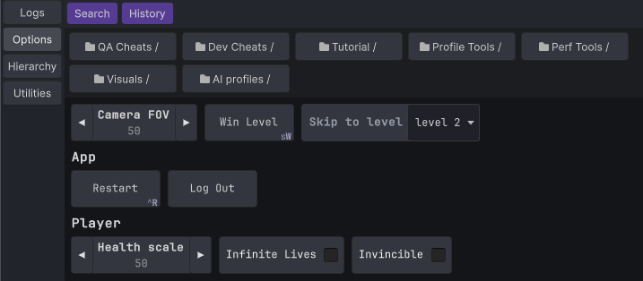
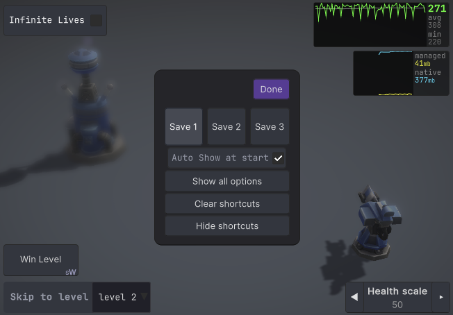

# 🛠️ Options Menu / Cheats

You can build interactive menus for in-game tools, debug settings, or cheat features — great for prototyping or QA workflows.



🧭 Two Ways to Add Options

## 🏷️ Add Option Items with \[ConsoleOption\] Attribute

You can easily register fields, properties or methods as menu items using the attribute.

Call this during setup to register all `[ConsoleOption]` entries on a class:
```
void Start()
{
        NjConsole.Options.CreateCatalogFrom(this, "TestOptions");
        // ^ second param `TestOptions` is optional, it puts all the items inside the `TestOptions` folder in this example.
        // If 'this' is a MonoBehaviour, options will auto-remove when `OnDestroy()`
}
```
> ⚠️ To add static members, you need to pass the type instead.   
> `NjConsole.Options.CreateCatalogFrom(typeof(DemoNjConsole));`   
> The separation exists because the static nature means it can persist without having an instance alive.   

### 🔘 Buttons
```
[ConsoleOption]
void SayHello() {
        Debug.Log("Hello");
}

// directory / folder
[ConsoleOption("ChildFolder/My Second Button")]
void AnotherButton() {
        Debug.Log("Clicked my second [ConsoleOption] button");
}

// header
[ConsoleOption("A button inside a header", 
                header:"My Header")]
void AButtonInsideHeader() {
        Debug.Log("Clicked my second [ConsoleOption] button");
}

// key binding - Shift + W to call WinLevelCheat() in playmode
[ConsoleOption(key:Key.W, 
                keyModifier:ConsoleKeyBindings.Modifier.Shift)]
void WinLevelCheat() {
        Debug.Log("Clicked WinLevelCheat");
}

// auto close console overlay
[ConsoleOption(autoClose:true)]
void AutoCloseConsole() {
        Debug.Log("Console overlay should be closed now that you clicked a button with auto close flag");
}
```

### ✅ Toggles
```
[ConsoleOption()]
bool InfiniteLives;

[ConsoleOption()]
bool InfiniteAmmo {get; set;}
```
> Warning: Keybinding feature only works for buttons and toggles.

### 🔢 Numbers
```
[ConsoleOption]
int Health;

[ConsoleOption]
int HealthProperty {get; set;}

// With left and right step buttons
[ConsoleOption(increments:0.5f)]
float Speed;

// Range clamping
[ConsoleOption()]
[Range(1, 5)] // FYI: If you use a version before Unity 6, RangeAttribute can not be used in properties
int Strength;
```

### 🔢 Text fields
```
[ConsoleOption]
[Multiline] // if you need multiline text entry, put [Multiline] attribute. 
string UserCommentMessage;

[ConsoleOption]
void SaySomething(string receivedText)
{
        Debug.Log("You said: " + receivedText);
}
```

### 🔽 Enum Dropdown
```
[ConsoleOption]
DeviceOrientation preferredOrientation;
```

### ⚠️ Command Line fallback for unsupported options
Members marked with `[ConsoleOption]` that the Options Menu can’t render are hidden (e.g. requiring multiple parameters or use unsupported types).   
Hidden options are still callable via the Command Line.   
A notice like “3 hidden item(s)” and a button to open Command Line will display.   
Example:
```
[ConsoleOption("Demo/Introduce")]
void IntroduceFromPerson(string name, int age)
{
    Debug.Log($"Hello, my name is {name}. I am {age} years old.");
}
```
Call from Command Line:
```
demo/introduce "Ninjadini" 30
```
See [Command Line](commandline.md) for more details. 

---

## 🧩 Add Option Items Programmatically

Use this method for full control and dynamic setup.

```var catalog = NjConsole.Options.CreateCatalog();```
> Catalogs are useful because when you no longer need a set of option menus, you can just call `catalog.RemoveAll()`.  

### 🔘 Buttons
```
catalog.AddButton("My First Button", () => Debug.Log("Clicked my first button"));

// directory / folder
catalog.AddButton("A Folder / Child Folder / Child Button", () => Debug.Log("Child button was clicked"));

// header sub-grouping
catalog.AddButton("A button in a header sub-group", () => {})
        .SetHeader("My Header");

// key binding to space key
catalog.AddButton("My Space Key Bound Button", () => Debug.Log("Clicked my Space key bound button"))
        .BindToKeyboard(KeyCode.Space);

// auto close console overlay
catalog.AddButton("My auto close button", () => Debug.Log("Console overlay should be closed now that you clicked a button with auto close flag"))
        .AutoCloseOverlay();
```


### ✅ Toggles
```
var toggle1 = false;
var toggle2 = false;

catalog.AddToggle("My First Toggle", (v) => toggle1 = v, () => toggle1);

// folder + key binding + auto close
catalog.AddToggle("A Folder / My T key Bound Toggle", (v) => toggle2 = v, () => toggle2);
        .BindToKeyboard(KeyCode.T)
        .AutoCloseOverlay();
```

> Both buttons and toggles can be bound to a keyboard key via `...BindToKeyboard(KeyCode.Space)`.  
> Shift + Ctrl + E style combo can be done via `...BindToKeyboard(KeyCode.E, ConsoleKeyBindings.Modifier.Shift | ConsoleKeyBindings.Modifier.Ctrl)`.  
> ⚠️ Only one keybinding per item.  
>    
> Set console overlay to auto close after you press the button via `...AutoCloseOverlay()`.  


### 🔢 Numbers
```
var aFloat = 12.34f;
catalog.AddNumberPrompt("A Number", (v) => aFloat= v, () => aFloat);

// clamped int number
var int0To100 = 50;
catalog.AddNumberPrompt("0 to 100", (v) => int0To100 = Mathf.Clamp(v, 0, 100), () => int0To100);

// Number prompt with left and right step buttons
var steppedNumber = 10;
catalog.AddNumberPrompt("Stepped number", (v) => steppedNumber = v, () => steppedNumber, 2);
```

### 🔢 Text fields
```
var text = "Initial text";
catalog.AddTextPrompt("My Text Prompt", (v) => text = v, () => text);

// Text prompt with submission validation and input restriction
var text2 = "Initial text";
catalog.AddTextPromptWithValidation("My validated text", 
  getter: () => text2, 
  setter: v => {
        if(v.All(char.IsUpper)) // in this example we only accept capital letters
        {
                text2 = v;
                return true; // return true to accept the input and close the prompt.
        }
        return false; // Return false to block user from closing the dialog due to invalid value.
  },
  validator: (v) => {
        if (v.Length > 5) v = v.Substring(0, 5); // Trim out invalid characters (or length) and return the valid version (optional)
        return v;
  } );
```

### 🔽 Dropdown choices
```
var choices = new List<string>() { "A", "B", "C", "D" };
var index = 0;
catalog.AddChoice("A Choice List", choices, () => index, (v) => index = v);

// An enum choice:
var platform = RuntimePlatform.OSXEditor;
options.AddEnumChoice("A Choice Enum", () => platform, (v) => platform = v);

```
> 💡 Use grouped paths (like "Category / Subgroup / Option") to keep menus organized and easier to navigate:  
> `catalog.AddButton("App / Utilities / Reload Scene", () => ReloadScene());`


## 🤔 Should You Use \[ConsoleOption\] or Add Programmatically?

**Use \[ConsoleOption\] when:**  
- You want a quick and declarative way to expose instance values and methods
- You want automatic cleanup when the object is destroyed (MonoBehaviour only)

**Use programmatic registration when:**  
- You want fine-grained control over when and how options appear
- You want slightly faster setup (bypassing reflection)
- You need dynamic options (e.g. buttons generated per inventory item):  
```
foreach (var itemType in inventoryItemTypes)
{
        var local = itemType;
        catalog.AddButton("Inventory/Give " + itemType.Name, () => GiveItem(local));
}
```

<div class="page" />


## 🎯 Shortcuts

You can create runtime shortcut buttons for quick access to options.
> **Note:** Shortcuts are available only in runtime overlay mode, not in the editor window.



### 📌 How to Create a Shortcut
- Press and hold on any option item or folder in the options menu.
- Drag it to a screen corner to create a shortcut.

Shortcuts will align to one of four corners:
- Items fill horizontally or vertically based on your drag position.
- For example: top-left corner can fill right or down depending on where you drop.

### ✏️ Shortcut Edit Mode
Once you drop your first shortcut, you’ll enter shortcut edit mode:
- 🟦 Drag & drop existing items to reposition them.
- 🔁 Switch between 3 different shortcut layouts (slots 1–3).
- ⚙️ Toggle Auto Show at Start to display shortcuts on game launch.
- 🧠 Shortcuts sync with menu visibility — they appear/disappear as the linked options do.
- 🫥 If you pressed `hide shortcuts`, use: Console > Options > Show Shortcuts to reopen edit mode.


[NjConsole doc home](index.md)