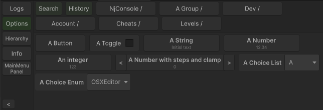
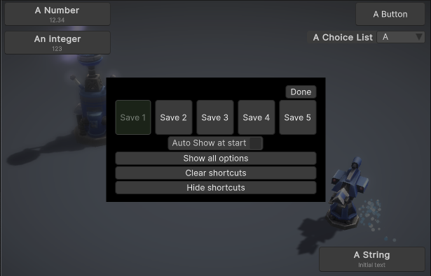

# 🛠️ Options Menu / Cheats

Build interactive menus for in-game tools, debug settings and cheats — great for prototyping and QA.



The panel header has **Search** (find an item anywhere in the tree), **History** (recently used), and the two
**Shortcuts** buttons covered below. Search and History results link back to the folder the item lives in.

🧭 Two Ways to Add Options

## 🏷️ Add Option Items with `[ConsoleOption]` Attribute

Register fields, properties or methods as menu items. Call this once during setup:
```
void Start()
{
        NjConsole.Options.CreateCatalogFrom(this, "TestOptions");
        // ^ second param `TestOptions` is optional, it puts all the items inside the `TestOptions` folder in this example.
        // If 'this' is a MonoBehaviour, options will auto-remove when `OnDestroy()`
}
```
> ⚠️ For static members pass the type instead: `NjConsole.Options.CreateCatalogFrom(typeof(DemoNjConsole));`
> They're separate because statics persist without a live instance.

### 🔘 Buttons
```
[ConsoleOption]
void SayHello() {
        Debug.Log("Hello");
}

// directory / folder
[ConsoleOption("ChildFolder/My Second Button")]
void AnotherButton() {
        Debug.Log("Clicked my second [ConsoleOption] button");
}

// header
[ConsoleOption("A button inside a header", 
                header:"My Header")]
void AButtonInsideHeader() {
        Debug.Log("Clicked my second [ConsoleOption] button");
}

// key binding - Shift + W to call WinLevelCheat() in playmode
[ConsoleOption(key:Key.W, 
                keyModifier:ConsoleKeyBindings.Modifier.Shift)]
void WinLevelCheat() {
        Debug.Log("Clicked WinLevelCheat");
}

// auto close console overlay
[ConsoleOption(autoClose:true)]
void AutoCloseConsole() {
        Debug.Log("Console overlay should be closed now that you clicked a button with auto close flag");
}
```

> ⌨️ `key:` takes `UnityEngine.InputSystem.Key` on the new **Input System**, `UnityEngine.KeyCode` on the legacy
> **Input Manager** — the Options panel's help text always shows the right one. Key bindings are Editor-only
> until you enable `Features > In Player Key Bindings`.

### ✅ Toggles
```
[ConsoleOption()]
bool InfiniteLives;

[ConsoleOption()]
bool InfiniteAmmo {get; set;}
```
> Warning: Keybinding feature only works for buttons and toggles.

### 🔢 Numbers
```
[ConsoleOption]
int Health;

[ConsoleOption]
int HealthProperty {get; set;}

// With left and right step buttons
[ConsoleOption(increments:0.5f)]
float Speed;

// Range clamping
[ConsoleOption()]
[Range(1, 5)] // FYI: If you use a version before Unity 6, RangeAttribute can not be used in properties
int Strength;
```

### 🔢 Text fields
```
[ConsoleOption]
[Multiline] // if you need multiline text entry, put [Multiline] attribute. 
string UserCommentMessage;

[ConsoleOption]
void SaySomething(string receivedText)
{
        Debug.Log("You said: " + receivedText);
}
```

### 🔽 Enum Dropdown
```
[ConsoleOption]
DeviceOrientation preferredOrientation;
```

### ⚠️ Command Line fallback for unsupported options
Members the Options Menu can't render — multiple parameters, unsupported types — are hidden, but still callable
from the Command Line. You'll see a “3 hidden item(s)” notice with a button to open it. Example:
```
[ConsoleOption("Demo/Introduce")]
void IntroduceFromPerson(string name, int age)
{
    Debug.Log($"Hello, my name is {name}. I am {age} years old.");
}
```
Call from Command Line:
```
demo/introduce "Ninjadini" 30
```
See [Command Line](commandline.md) for more details. 

---

## 🧩 Add Option Items Programmatically

For full control and dynamic setup.

```var catalog = NjConsole.Options.CreateCatalog();```
> A catalog is the unit of cleanup — `catalog.RemoveAll()` when you're done with the set.

### 🔘 Buttons
```
catalog.AddButton("My First Button", () => Debug.Log("Clicked my first button"));

// directory / folder
catalog.AddButton("A Folder / Child Folder / Child Button", () => Debug.Log("Child button was clicked"));

// header sub-grouping
catalog.AddButton("A button in a header sub-group", () => {})
        .SetHeader("My Header");

// key binding to space key
catalog.AddButton("My Space Key Bound Button", () => Debug.Log("Clicked my Space key bound button"))
        .BindToKeyboard(KeyCode.Space);

// auto close console overlay
catalog.AddButton("My auto close button", () => Debug.Log("Console overlay should be closed now that you clicked a button with auto close flag"))
        .AutoCloseOverlay();
```


### ✅ Toggles
```
var toggle1 = false;
var toggle2 = false;

catalog.AddToggle("My First Toggle", (v) => toggle1 = v, () => toggle1);

// folder + key binding + auto close
catalog.AddToggle("A Folder / My T key Bound Toggle", (v) => toggle2 = v, () => toggle2)
        .BindToKeyboard(KeyCode.T)
        .AutoCloseOverlay();
```

> Buttons and toggles take `.BindToKeyboard(KeyCode.Space)`, or a combo via
> `.BindToKeyboard(KeyCode.E, ConsoleKeyBindings.Modifier.Shift | ConsoleKeyBindings.Modifier.Ctrl)`.
> One keybinding per item. `.AutoCloseOverlay()` closes the overlay after a press.


### 🔢 Numbers
```
var aFloat = 12.34f;
catalog.AddNumberPrompt("A Number", (v) => aFloat= v, () => aFloat);

// clamped int number
var int0To100 = 50;
catalog.AddNumberPrompt("0 to 100", (v) => int0To100 = Mathf.Clamp(v, 0, 100), () => int0To100);

// Number prompt with left and right step buttons
var steppedNumber = 10;
catalog.AddNumberPrompt("Stepped number", (v) => steppedNumber = v, () => steppedNumber, 2);
```

### 🔢 Text fields
```
var text = "Initial text";
catalog.AddTextPrompt("My Text Prompt", (v) => text = v, () => text);

// Text prompt with submission validation and input restriction
var text2 = "Initial text";
catalog.AddTextPromptWithValidation("My validated text", 
  getter: () => text2, 
  setter: v => {
        if(v.All(char.IsUpper)) // in this example we only accept capital letters
        {
                text2 = v;
                return true; // return true to accept the input and close the prompt.
        }
        return false; // Return false to block user from closing the dialog due to invalid value.
  },
  validator: (v) => {
        if (v.Length > 5) v = v.Substring(0, 5); // Trim out invalid characters (or length) and return the valid version (optional)
        return v;
  } );
```

### 🔽 Dropdown choices
```
// Note the setter comes before the getter, same as AddToggle / AddNumberPrompt.
var choices = new List<string>() { "A", "B", "C", "D" };
var index = 0;
catalog.AddChoice("A Choice List", choices, (v) => index = v, () => index);

// An enum choice:
var platform = RuntimePlatform.OSXEditor;
catalog.AddEnumChoice("A Choice Enum", (v) => platform = v, () => platform);

// The choices list is live - edit it later and the dropdown follows.
// Or pass onBeforeDropDownListing to refill it right before the dropdown opens:
catalog.AddChoice("Live list", choices, (v) => index = v, () => index, () => RefillChoices(choices));
```
> 💡 Grouped paths keep menus navigable: `catalog.AddButton("App / Utilities / Reload Scene", () => ReloadScene());`


## 🤔 Should You Use `[ConsoleOption]` or Add Programmatically?

**`[ConsoleOption]`** — quick and declarative, and cleans up automatically when the MonoBehaviour is destroyed.

**Programmatic** — control over when and how options appear, slightly faster (no reflection), and the only way
to build options dynamically:
```
foreach (var itemType in inventoryItemTypes)
{
        var local = itemType;
        catalog.AddButton("Inventory/Give " + itemType.Name, () => GiveItem(local));
}
```

<div class="page"></div>


## 🎯 Shortcuts

Pin an option item — or a whole folder — somewhere reachable without walking the menu. Two kinds, one header
button each:

| Button | Kind | Where it lives | Available in |
|---|---|---|---|
| `≡ Shortcuts` | **Menu shortcuts** | A pinned list at the top of the Options panel | Editor window **and** runtime overlay |
| `□ Shortcuts` | **Overlay shortcuts** | Floating buttons snapped to a screen corner | Runtime overlay only |



### 📌 How to Create a Shortcut
Press and hold any option item or folder, then drag.
- **Editor window** — it goes into the menu shortcuts list.
- **Runtime overlay** — drag to a screen corner for an overlay shortcut, or drop on the
  `Add to Menu ≡ Shortcuts` zone for the menu list instead.

Overlay shortcuts snap to one of four corners and fill horizontally or vertically depending on where you
drop — top-left can fill right or down.

### ✏️ Overlay shortcut edit mode
Dropping your first overlay shortcut enters edit mode:
- 🟦 Drag existing items to reposition them.
- 🔁 Switch between 4 layouts (`Set 1`–`Set 4`).
- 📋 `Show all options` adds more without leaving edit mode.
- ⚙️ `Auto Show at start` displays them on game launch.
- 🧠 Shortcuts follow their linked options — they appear and disappear together.
- ✅ `Done` leaves edit mode; after `Hide shortcuts`, reopen it with the `□ Shortcuts` button.

### ✏️ Menu shortcuts
5 layout slots (`Set 1`–`Set 5`). The `≡` button on the toolbar offers **Copy** / **Paste** / **Clear** —
copy/paste goes via the system clipboard, so you can share a set with a teammate or move it between the
editor window and a device.

---

## 🖥️ Editor-only options

`NjConsole.Options` is for play mode. For items that work **outside** play mode use
`NjConsole.EditModeOptions` — they appear in the console window's `Editor Options` panel and survive
entering and leaving play mode.

```csharp
var catalog = NjConsole.EditModeOptions.CreateCatalog();
catalog.AddButton("My Editor Button", () => Debug.Log("Clicked my editor button"));
```
Same catalog API. Register from editor-only code — an `Editor` assembly or an `[InitializeOnLoad]` class —
so nothing reaches your player build. [Custom Panels](custompanels.md) applies the same idea to whole panels.

---

## 🧹 Removing options

A catalog is the unit of cleanup:
```csharp
catalog.RemoveAll();                      // remove everything this catalog added
catalog.Remove("A Folder / My Button");   // remove one item by path
```
Both only touch items **this** catalog added. To clear a path regardless of owner, use
`RemoveIncludingConflicts(path)` / `RemoveAllIncludingConflicts()`.

`CreateCatalogFrom(monoBehaviour)` removes its items on destroy already — pass
`autoRemoveOnMonoBehaviourDestroy: false` to manage it yourself.

---

## ⌨️ Binding keys without a menu item

`.BindToKeyboard()` is the usual route, but you can bind directly too:
```csharp
NjConsole.KeyBindings.BindKeyDown(() => Debug.Log("C key was pressed"), KeyCode.C);
NjConsole.KeyBindings.BindKeyDown(() => Debug.Log("Shift + C"), KeyCode.C, ConsoleKeyBindings.Modifier.Shift);
NjConsole.KeyBindings.UnbindKeyDown(KeyCode.C, ConsoleKeyBindings.Modifier.None);
```
There are `UnityEngine.InputSystem.Key` overloads of each of these too.

> In the Editor these work without passing the access challenge. In player builds they're off unless
> `Features > In Player Key Bindings` is enabled, and then only after the challenge is passed.

---

## 💬 Tooltips / hint text

Any item can carry a hint, shown in the UI and in Command Line autocomplete:
```csharp
catalog.AddButton("Reload Scene", ReloadScene).SetTooltip("Reloads the currently active scene");
```
With the attribute, use Unity's `[Tooltip]`:
```csharp
[ConsoleOption("profile/name")]
[Tooltip("Get or set user profile name")]
public string Name;
```

[NjConsole doc home](index.md)